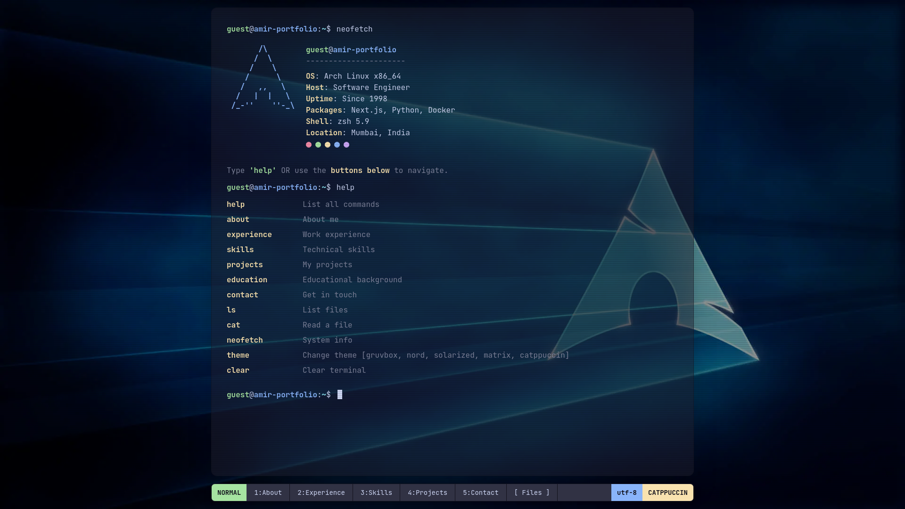

# Arch Linux Terminal Portfolio Template 🚀

Highly customizable, terminal-themed portfolio inspired by the **Arch Linux** aesthetic. Built with **Next.js 16**, **Tailwind CSS 4**, and **React 19**, this template offers a unique and nostalgic developer experience.



## ✨ Features

- **💻 Interactive Terminal**: Fully functional terminal interface with a growing list of commands.
- **🔍 Smart Autocomplete**: Real-time command suggestions and `Tab` key auto-completion.
- **🎨 Multi-Theme System**: Switch between **Gruvbox**, **Nord**, **Solarized**, **Matrix**, and **Catppuccin** with a single button or command.
- **🖼️ Premium Wallpaper**: Integrated high-quality Arch-themed background with dynamic overlays.
- **📱 Responsive Design**: Optimized for both desktop and mobile terminal experiences.
- **⚡ Performance First**: Zero-latency theme switching and ultra-lightweight components.

## 🛠️ Tech Stack

- **Framework**: [Next.js 16](https://nextjs.org/) (App Router)
- **Styling**: [Tailwind CSS 4](https://tailwindcss.com/)
- **Core**: [React 19](https://react.dev/)
- **Icons**: [Lucide React](https://lucide.dev/)
- **State Management**: React Context API

## 🚀 Getting Started

### Prerequisites

- Node.js 18.x or later
- npm / pnpm / yarn

### Installation

1. **Clone the repository:**

   ```bash
   git clone https://github.com/amirk85/arch-portfolio.git
   cd arch-portfolio
   ```

2. **Install dependencies:**

   ```bash
   pnpm install
   # or
   npm install
   ```

3. **Run the development server:**

   ```bash
   pnpm dev
   ```

4. **Open your browser:**
   Navigate to [http://localhost:3000](http://localhost:3000) to see your portfolio in action.

## 📝 Configuration

All portfolio data (projects, education, skills, social links) is centrally managed in:
`src/config/portfolio.ts`

To change the available themes or colors, modify:
`src/config/themes.ts`
`src/app/globals.css`

## 🤝 Support & Contribution

This is a **free-to-use template** for the developer community. If you find it useful:

1.  🌟 **Give it a Star**: It helps more people discover this project.
2.  🏷️ **Give Credit**: If you use this template for your own portfolio, please keep the credit link in the footer or mention this repository in your README.

Contributions are always welcome! Feel free to open an issue or submit a pull request.

## 📄 License

This project is open-source and available under the [MIT License](LICENSE).

---

_Made with ❤️ by Amir for the Linux community._
